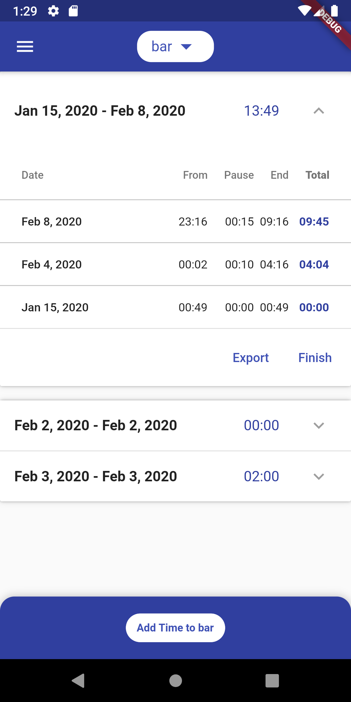
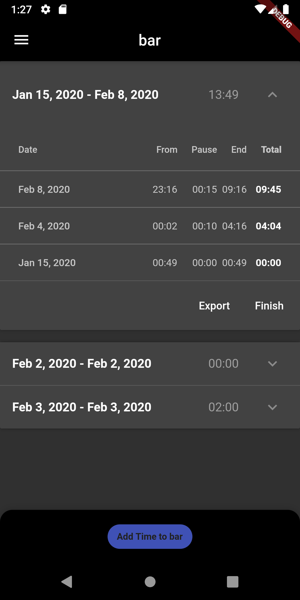
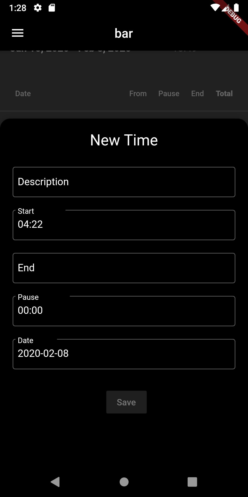
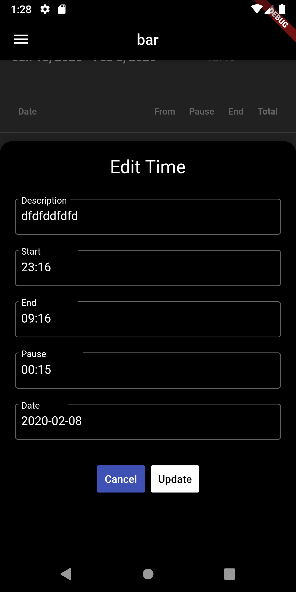
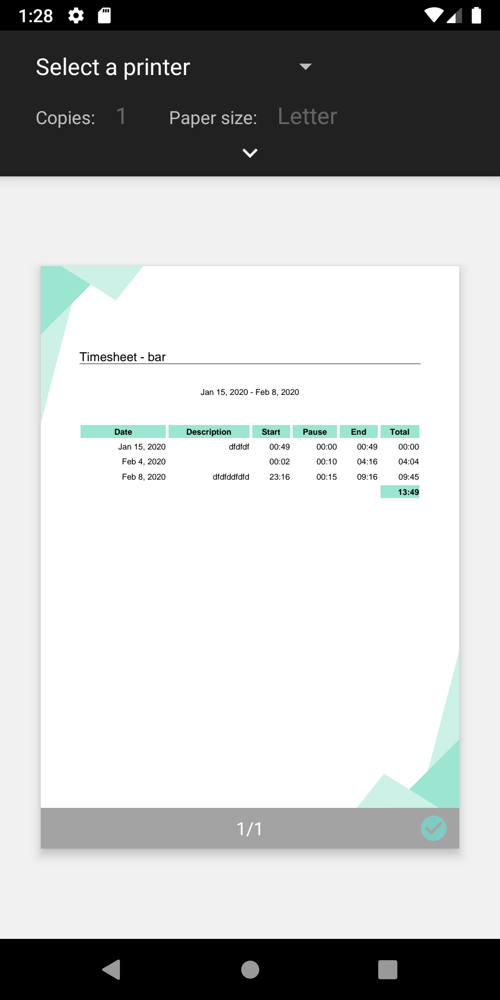
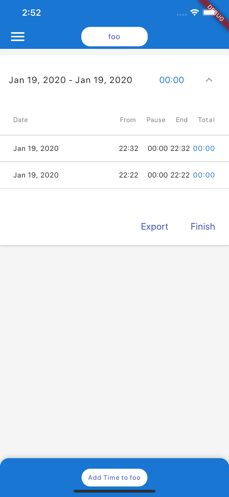
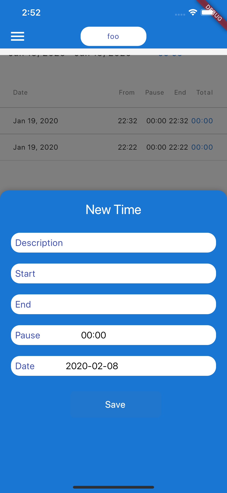
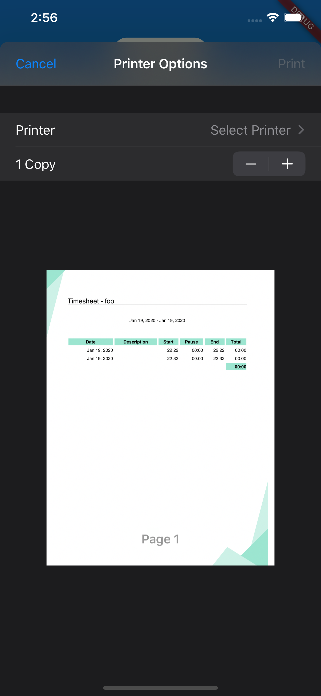

# Flutter Timesheet App


> a Timesheet Application, because all others suxx ;)

This whole App is totally educational to me. If you value this work (like me) download the App
from the App-Store of your Platform :)

<a href="" target="_blank"></a>
<a href="" target="_blank"></a>


## Highlights

* 🤖 🍎 Cross-Platform (native Android/IOS Components)
* 📲 Adaptive Layouts for different Orientations and Devices
* 🧠 Mobx for State-Management
* 💾 Stored in Local-Storage
* ⬇️ Export/Import Data from other Instances 
* 🖥 Works on Web (t.b.d.)
* 🌓 Dark Mode aware

**Android**

|  |  |  |  |  |
|------------|-------------|-------------|-------------|-------------|

**iOS**

|  |  |  |
|------------|-------------|-------------|

## Features

* multiple Clients
* PDF Export of Timesheets
* automatic Range/Sum of Timesheets
* editable/deletable Times
* automatic dark mode detection

## Getting Started

we store everything inside a `Makefile`.

**Install flutter dependencies**

```shell script
$ make install
```

**Watch `mobx` part generations when editing Stores**

```shell script
$ make codegen-watch
```

**Run Tests**

```shell script
$ make test
```

**Rebuild Icons**

```shell script
$ make icons
```

**Create Production Bundles**

```shell script
$ make bundle
```

**Sync Production Bundle to a device**

```shell script
$ make to_device
```

## TODOS

* Landscape Mobile
* Portrait/Landscape Tablet
* Portrait/Landscape Web
