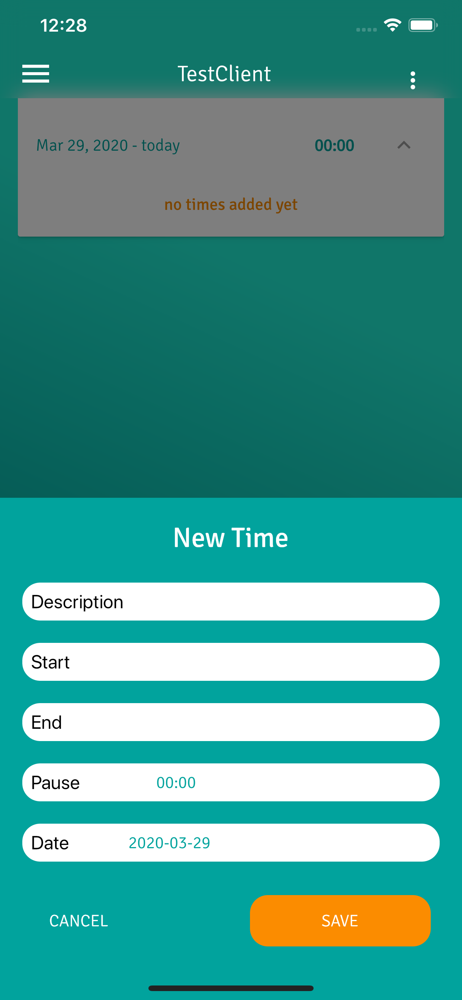

# Flutter Timesheet App


> a Timesheet Application, because all others suxx ;)

This whole App is totally educational to me. I used it for learning [Dart](https://dart.dev/) and [Flutter](https://flutter.dev/). If you value this work (like me) download the App
from the App-Store of your Platform :)

<a href="https://play.google.com/store/apps/details?id=net.digitalkaoz.timesheet_flutter" target="_blank"></a>
<a href="https://apps.apple.com/us/app/timesheets-by-digitalkaoz/id1498314656" target="_blank"></a>


## Features
* multiple clients
* automatic Range/Sum of Timesheets
* editable/deletable Times
* automatic dark mode detection
* export/print timesheets as PDF
* dynamic billing ranges
* export/import Data from other Instances

## Technical Highlights

* 🤖 🍎 Cross-Platform (native Android/IOS Components)
* 📲 Adaptive Layouts for different Orientations and Devices
* 🧠 Mobx for State-Management
* 💾 Stored in Local-Storage
* 🖥 Works on Web (t.b.d.)
* 🌓 Dark Mode aware
* 🤖 🍎 native Controls


**Android**

|  |  |  |  |
|------------|-------------|-------------|-------------|

**iOS**

|  |  |  |  |  |
|------------|-------------|-------------|-------------|-------------|


## Getting Started

we store everything inside a `Makefile`.

**Install flutter dependencies**

```shell script
$ make install
```

**Watch `mobx` part generations when editing Stores**

```shell script
$ make codegen-watch
```

**Run Tests**

```shell script
$ make test
```

**Rebuild Icons**

```shell script
$ make icons
```

**Create Production Bundles**

```shell script
$ make build
```

## TODO

* darkmode ui glitches
* functional tests
* multi-device with firebase ?
